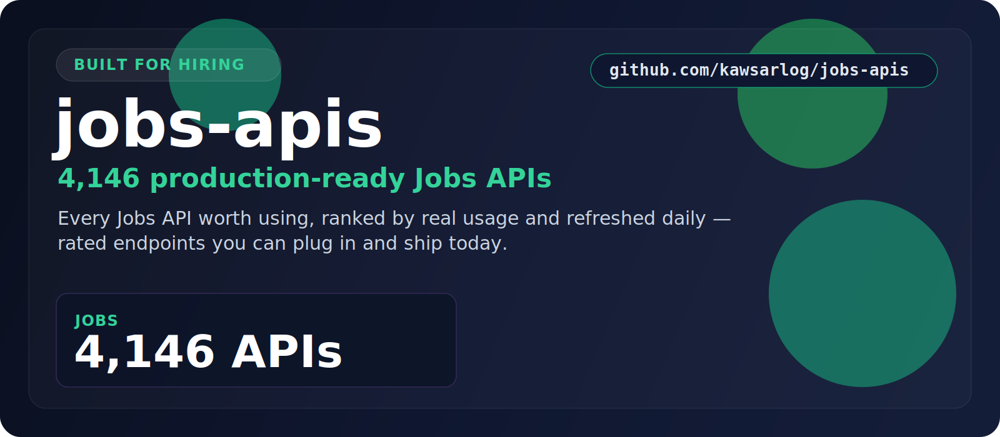

  

  <a href="#at-a-glance"><b>At a Glance</b></a> &nbsp;•&nbsp;
  <a href="#the-categories"><b>Categories</b></a> &nbsp;•&nbsp;
  <a href="#start-here"><b>Start Here</b></a> &nbsp;•&nbsp;
  <a href="#built-for"><b>Built For</b></a> &nbsp;•&nbsp;
  <a href="#why-this-repo"><b>Why This Repo</b></a>

## At a Glance

> **4,099** production-ready Jobs APIs for aggregating listings, salaries, and hiring signals.

A focused, always-fresh index of Jobs APIs for aggregating listings, salaries, and hiring signals. Every entry is rated, shows real user counts, and is refreshed daily — so you find the right one fast.

| Metric | Value |
|--------|-------|
| **Total APIs** | **4,099** |
| **Categories** | 1 |
| **Last updated** | 2026-07-15 |
| **Update cadence** | Daily, automated |

## The Categories

<table>
  <tr>
    <td width="100%" valign="top">
      <h3>Jobs</h3>
      
<strong>4,099 APIs</strong>

      
Job listings, salary data, and hiring signals aggregated from across the web.

      
<a href="./Jobs/"><strong>Open Jobs &rarr;</strong></a>

    </td>
  </tr>
</table>

## Start Here

1. Pick the category that matches what you're building.
2. Open its folder and scan the API names, ratings, and user counts.
3. Click through to the provider page for docs, pricing, and setup.
4. Shortlist in minutes — no digging through unrelated categories.

## Explore the Stack

<strong>Jobs — 4,099 APIs</strong>

Job listings, salary data, and hiring signals aggregated from across the web.

[Browse Jobs APIs &rarr;](./Jobs/)

## Built For

<table>
  <tr>
    <td width="25%" align="center"><strong>Job boards</strong></td>
    <td width="25%" align="center"><strong>ATS tools</strong></td>
    <td width="25%" align="center"><strong>Recruiting</strong></td>
    <td width="25%" align="center"><strong>Salary research</strong></td>
  </tr>
  <tr>
    <td width="25%" align="center"><strong>Market intel</strong></td>
    <td width="25%" align="center"><strong>Aggregators</strong></td>
    <td width="25%" align="center"><strong>HR tech</strong></td>
    <td width="25%" align="center"><strong>Career apps</strong></td>
  </tr>
</table>

## Why This Repo

- **Opinionated, not exhaustive.** Only the categories that matter here — no clutter.
- **Always fresh.** A scheduled job re-scrapes the source and updates the counts daily.
- **Fast to scan.** Ratings and real usage numbers surface the APIs worth your time.
- **Consistent.** Every category follows the same clean, sortable layout.

## Star History

---

**4,099 APIs** across **1 categories** — updated 2026-07-15
 If this saved you time, a star helps others find it.

